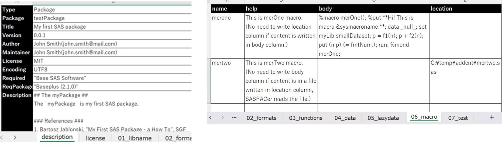

# SASPACer (latest version 0.1.1 on 9July2025)
A SAS package to help creating SAS packages

&nbsp;&nbsp;&nbsp;&nbsp;&nbsp;&nbsp;&nbsp;&nbsp;&nbsp;&nbsp;&nbsp;&nbsp;&nbsp;&nbsp;&nbsp;&nbsp;&nbsp;&nbsp;&nbsp;&nbsp;

**"サスパッカー"** in the logo stands for **SASPACer** in Japanese. The package is to help creating SAS packages.  Shaping onigiri(rice ball) by hands can be a bit challenging for beginners, but using onigiri mold makes it easy to form and provides a great introduction. Hope the mold(SASPACer) will help you to create your SAS package.

## %ex2pac() : excel to package
1. **Put information** of SAS package you want to create **into an excel spreadsheet**  (you can find template file in ./SASPACer/addcnt)

2. %ex2pac() will convert the excel spreadsheet into SAS package structure(folders and files) and execute %generatePackage() (optional) for package zip file

Sample code:
~~~sas
%ex2pac(
	excel_file=C:\Temp\template_package.xlsx,		/* Path of input excel file */
	package_location=C:\Temp\SAS_PACKAGES\packages,		/* Output path */
	complete_generation=Y)					/* Set Y(default) to execute %generagePackage() for completion */
~~~
This allows you to create SAS packages via simple format of excel!  
You can learn from the following training materials by Bartosz Jablonski for source files and folders structure of SAS packages.  
[My first SAS Package -a How To](https://github.com/yabwon/SAS_PACKAGES/blob/main/SPF/Documentation/SAS(r)%20packages%20-%20the%20way%20to%20share%20(a%20how%20to)-%20Paper%204725-2020%20-%20extended.pdf)   
[SAS Packages - The Way To Share (a How To)](https://github.com/yabwon/SAS_PACKAGES/blob/main/SPF/Documentation/SAS(r)%20packages%20-%20the%20way%20to%20share%20(a%20how%20to)-%20Paper%204725-2020%20-%20extended.pdf)  

## %pac2ex() : package to excel
Under construction, stay tuned!

## Version history  
0.1.1(9July2025)	: Minor updates in excel templates and cosmetic change in license(no change in contents)  
0.1.0(29June2025)	: Modified logic (overwriting existing package folder -> Stop with error message to clear up the existing package folder(user should empty the existing folder first))  
0.0.5(14June2025)	: easyArch=1 was set in %generatePackage() used in complete_generation=Y  
0.0.4(29May2025)	: Codes were brushed up and enhanced documents  
0.0.3(20April2025)	: Bugs fixed and enhanced documents (separated internal macros, fixed bugs, limitations and notes added)  
0.0.2(20April2025)	: Minor updates  
0.0.1(13April2025)	: Initial version

## What is SAS Packages?
The package is built on top of **SAS Packages framework(SPF)** developed by Bartosz Jablonski.  
For more information about SAS Packages framework, see [SAS_PACKAGES](https://github.com/yabwon/SAS_PACKAGES).  
You can also find more SAS Packages(SASPACs) in [SASPAC](https://github.com/SASPAC).

## How to use SAS Packages? (quick start)
### 1. Set-up SPF(SAS Packages Framework)
Firstly, create directory for your packages and assign a fileref to it.
~~~sas      
filename packages "\path\to\your\packages";
~~~
Secondly, enable the SAS Packages Framework.  
(If you don't have SAS Packages Framework, installed follow the instruction in [SPF documentation](https://github.com/yabwon/SAS_PACKAGES/tree/main/SPF/Documentation) to install SAS Packages Framework.)  
~~~sas      
%include packages(SPFinit.sas)
~~~  
### 2. Install SAS package  
Install SAS package you want to use using %installPackage() in SPFinit.sas.
~~~sas      
%installPackage(packagename, sourcePath="\github\path\for\packagename.zip")
~~~
(e.g. %installPackage(ABC, sourcePath="https://github.com/XXXXX/ABC/raw/main/"))  
### 3. Load SAS package  
Load SAS package you want to use using %loadPackage() in SPFinit.sas.
~~~sas      
%loadPackage(packagename)
~~~
### Enjoy😁
---

